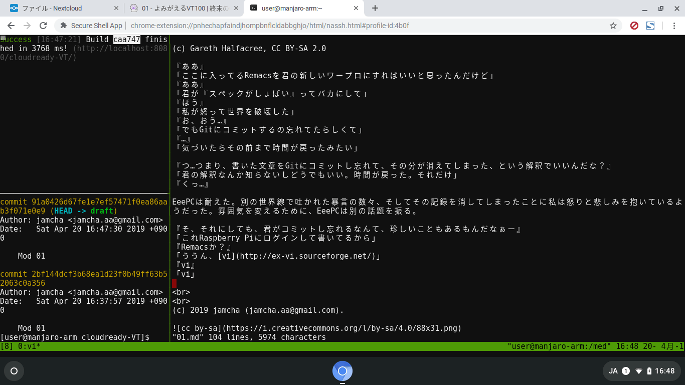

# 01 - よみがえるVT100

「このまえPentium IIIのパソコンに[Q4OS](https://q4os.org/)入れたんだけどさ」  
『ペンティアム3？』「20年前のパソコン。それでそのとき思ったんだけど」  
『20年前…』EeePCが私の話を無視し、怪訝な様子でたずねる。『何のために？』  

 

 

「なんのためにって、使うためだよ。決まってるじゃん」  
『何に使うんだ？インストールして悦に浸るためか』  
「そんなわけないでしょ。ちゃんとプリンター使ったり、たまーにDVD焼いたりするよ」  
『他には？』「え？他には…そりゃあ、『前世紀のパソコンが動いてる！』って感動するためですよ」  
『はぁ…』

EeePCはあきれてとびきりの熱気を吐き出したように見えた。

EeePCは10年以上にわたって私をサポートしつづけてきたコンピュータだ。昨年 [EeePCとEmacsと〇〇と](https://jamcha-aa.github.io/EeePC/) で現役復活を果たし、以来ワープロとして活躍してきた。けれども私が [Spacsmacs](http://spacemacs.org/)に惚れ込んでからというもの、非力なEeePCは裏方に回ることが多くなっている。[antiX](https://antixlinux.com/)やQ4OSといった軽量Linuxをお試しでインストールされることはあっても、以前のように使ってもらえない日々に少し不満のようだった。

『それで、その石でできたパソコンにLinuxを入れて何を思ったんだ？』  
「その冗談面白いね。お礼に君をハードオフに売ってあげようか」  
『往復にかかる費用を捨てたほうが時間を無駄にしないだけ得だぞ』  
「全くだね。ははははは」『ハハハハハ』  
「…お父さんのパソコン次にバカにしたら本当に壊すからね」『すみません』

父はそのパソコンで私にファンクションキーの使い方と麻雀のルールを教えてくれた。F7キーはカタカナ変換で、出ている牌がバラバラだと相手は国士無双をねらっている。ひと月に使えるインターネットは5時間で、メモリは64MBで、インターネットエクスプローラーから山のようにスパイウェアが入ってきた。まだ世界貿易センタービルはマンハッタンにそびえていた。

 

『では改めて、君が父上のパソコンを使って何を思ったのか、教えてくれないか』  
「古いコンピュータで高性能のコンピュータを動かせたら面白いなと思った」  
『…どういうことだ？』

私は自分のねらいをEeePCに伝えるため、一枚の写真を見せた。

 

  
(c) Jason Scott, CC BY 2.0

 

「これ [VT100](https://ja.wikipedia.org/wiki/VT100) っていうんだけど、今あるパソコンとはかなり違う。他のコンピュータに接続して操作する専用の道具」  
『どうしてそんなものが必要なんだ？』  
「昔はコンピュータが超高級品だったから、一台のコンピュータを何人かで使えるようにこういう道具があった。Facebookを使うためのFacebookアプリみたいなものかな」  
『ふむ』  
「Facebookみたいな巨大なコンピュータでも、スマホがあれば使える。似たような感じで、性能の高いコンピュータを操作する方法があれば、君みたいなへっぽこコンピュータにも生きる道があるかもしれない」  

 

ブツンッ。

 

＊＊＊＊

「あれ？」  
『何だ？』  
呆然とする私。問いかけるEeePC。手足を動かす私を不思議そうに見ている。『どうした？』  
「時間が巻き戻ったっぽい」『そんなまさか』「夢だったのかな」

実際はそんなことなどありえない。けれども、なおも私が身体をぺたぺたと触っているので、EeePCは『どんな夢だった？』とたずねた。

「ここに[Manjaro](https://manjaro.org)と[Remacs](https://github.com/remacs/remacs)の入った[Raspberry Pi](https://www.raspberrypi.org/)があるじゃろ？」

(c) Gareth Halfacree, CC BY-SA 2.0

『ああ』  
「ここに入ってるRemacsを君の新しいワープロにすればいいと思ったんだけど」  
『ああ』  
「君が『スペックがしょぼい』ってバカにして」  
『ほう』  
「私が怒って世界を破壊した」  
『お、おう…』  
「でもGitにコミットするの忘れてたらしくて」  
『…』  
「気づいたらその前まで時間が戻ったみたい」  

『つ…つまり、書いた文章をGitにコミットし忘れて、その分が消えてしまった、という解釈でいいんだな？』  
「君の解釈なんか知らないしどうでもいい。時間が戻った。それだけ」  
『くっ…』

EeePCは耐えた。別の世界線で吐かれた暴言の数々、そしてその記録を消してしまったことに私は怒りと悲しみを抱いているようだった。雰囲気を変えるために、EeePCは別の話題を振る。

『そ、それにしても、君がコミットし忘れるなんて、珍しいこともあるもんだなぁー』  
「これRaspberry Piにログインして書いてるから」  
『Remacsか？』  
「ううん、[vi](http://ex-vi.sourceforge.net/)」  
『vi』  
「vi」

 
 
(c) 2019 jamcha (jamcha.aa@gmail.com).

