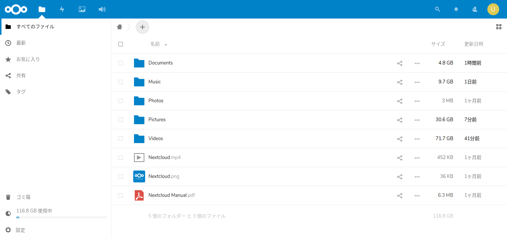
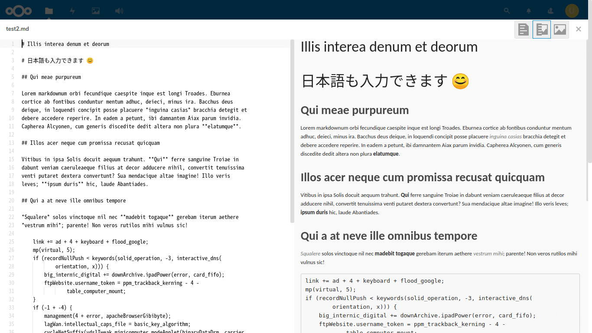

# 02 - vi

> [vi(ビ)は、UNIXを **使いにくい、わかりにくい、あの人だけ画面が黒い** というものにおとしめているテキストエディタである。](https://ja.uncyclopedia.info/wiki/Vi)

「冗談はさておき、なぜ私がviを使って書くことになってしまったのか、そこには深い深い理由があるのです」  
私は神妙な顔で、湯のみに入った緑茶をすすりながら言った。

「じゅるる…あー…じゅるる…あー…」  
『…あのー』  
「パキッ…サク…サク…ごくん」  
『理由…』  
「じゅるる…あー…」  
『顔のシワ増えたな』  
「シワなんてないよ！」

拳をテーブルにたたきつけた私は湯のみを倒し、危うくEeePCをショートさせるところだった。

 

「冗談はさておき、なぜ私がviを使って書くことになってしまったのか、そこには深い深い理由があるのです」  
私は神妙な顔で、湯のみに入った緑茶をすすりながら言った。

『二番茶はうまいか』  
「まろやかで美味しい」  
『そうか。そろそろ本題に入ってくれないか』  
「そうしたいのはやまやまなんだけど、ふざけすぎたせいでどうやって話を切り出したらいいかわからなくなっちゃった」  
『わかった。それじゃあ私がやさしく指導してあげるから、まず遮音カーテンを閉めてくれ』  
「お巡りさん、ここに言葉の暴力をふるおうとする機械がいます」

 

＊＊＊＊

 

「私はふだん、Raspberry Piにつなげたハードディスクをこんな感じでファイル置き場にしていて」  
『ほう』

「そこでMarkdownも書けるから」『おお、すごいなこれ』「でしょ？これで小説書けるじゃんって思ってました」

『何が問題なんだ？』  
「Gitが使えない」  
『Oh...』  
「ターミナルでログインすればGitも使えるんだけど」  
『ふむ…』  

 
 
(c) 2019 jamcha (jamcha.aa@gmail.com).

