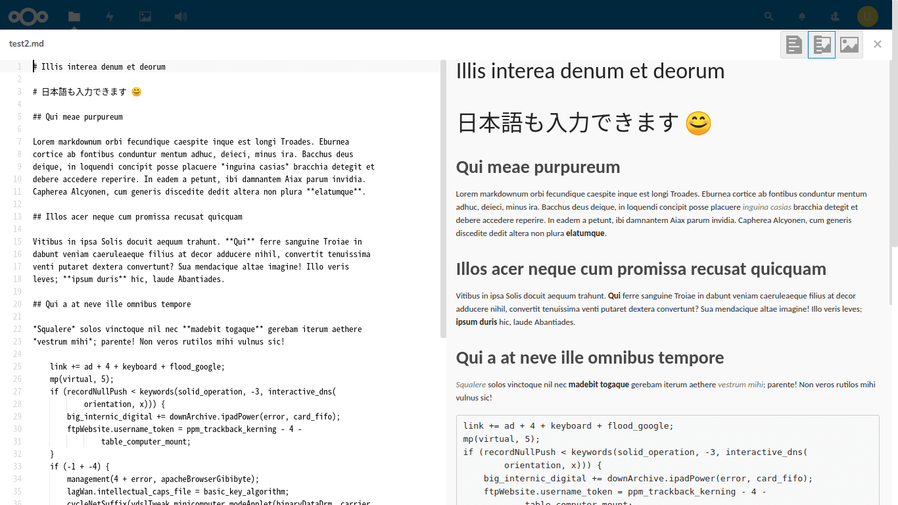

# 02 - viを使って書くことになった深い深い理由

> [vi(ビ)は、UNIXを **使いにくい、わかりにくい、あの人だけ画面が黒い** というものにおとしめているテキストエディタである。](https://ja.uncyclopedia.info/wiki/Vi)

「冗談はさておき、なぜ私がviを使って書くことになってしまったのか、そこには深い深い理由があるのです」  
私は神妙な顔で、湯のみに入った緑茶をすすりながら言った。

「じゅるる…あー…じゅるる…あー…」  
『…あのー』  
「パキッ…サク…サク…ごくん」  
『理由…』  
「じゅるる…あー…」  
『顔のシワ増えたな』  
「シワなんてありませんけど！？」

拳をテーブルにたたきつけた私は湯のみを倒し、危うくEeePCをショートさせるところだった。

<br>

「冗談はさておき、なぜ私がviを使って書くことになってしまったのか、そこには深い深い理由があるのです」  
私は神妙な顔で、湯のみに入った緑茶をすすりながら言った。

『二番茶はうまいか』  
「まろやかで美味しい」  
『そうか。そろそろ本題に入ってくれないか』  
「そうしたいのはやまやまなんだけど、ふざけすぎたせいでどうやって話を切り出したらいいかわからなくなっちゃった」  
『わかった。それじゃあ私がやさしく指導してあげるから、まず遮音カーテンを閉めてくれ』  
「お巡りさん、ここに言葉の暴力をふるおうとする機械がいます」

<br>

＊＊＊＊

<br>

「私はふだん、Raspberry Piにつなげたハードディスクをこんな感じでファイル置き場にしていて」  
『ほう』


「そこでMarkdownを書けるアプリがあるから」  
『おお、すごいなこれ』  
「でしょ？これで小説書けるじゃんって思ってました」



『何が問題なんだ？』  
「Gitが使えない」  
『Oh...』  
「ここで書いた文章をGitHubにいちいちアップロードしてもいいんだけど、なんかかっこわるい」  
『うむ…』   
「ターミナルでログインすればこんな感じでGitも使えるんだけど、また別の問題があって」


「ターミナルで作ったりコピーしたファイルは、さっきの画面に表示されないし反映もされない」  
『Oh...』  
「理由はファイル置き場の管理者と私が『別のユーザー』だからなんだけど」  
『ターミナルが使えるなら君が普段使っているエディタで書けばいいんじゃないのか？』  
「エディタ？Remacsのこと？Remacsはワープロなんだけど」  
『細かいことはいい。Remacsを使ったらどうなんだ』  
「使えない。ChromeのターミナルだとEmacsの操作ができないから。C-nだと新しいウインドウが開いて、C-pだと印刷画面が表示される」  
『キーの設定を変えればいいだろう』  
「あのね、私はノートパソコンをVT100みたいに使いたいと思ってるわけ。だからChromeOSの標準機能に入ってないカスタマイズはしない」  
『深い深い理由の意味がなんとなくわかってきたぞ…』

```sh
[user@manjaro-arm ~]$ vim
-bash: vim: コマンドが見つかりません
[user@manjaro-arm ~]$ 
```

「あとは使えそうなエディタはvimくらいなんだけど、Manjaroにはデフォルトでviもvimも入ってなかったと思う。[nano](https://ja.wikipedia.org/wiki/Nano_(テキストエディタ))は入ってたと思うけど、nanoを使うとついついEmacsのキー操作をしそうになるから使わない」  
『ふむ。そこでviをインストールしたわけだな』  
「うーん…そうでもなくて、たまたま何かの拍子に入ったから使えただけで、今回インストールしたわけじゃないんだ。だって、ChromeOSの設定を変えたくないからってRaspberry Piのほうをいじくりまわすのは、なんか不公平な感じしない？」  
『ふ、不公平って…君は変わった考え方をするんだな…う、うーむ、ではどのタイミングでviが使えるようになったんだろうな』


```sh
[user@manjaro-arm ~]$ pactree vi
```

    vi
    └─ncurses
      ├─glibc
      │ ├─linux-api-headers provides linux-api-headers>=4.10
      │ ├─tzdata
      │ └─filesystem
      │   └─iana-etc
      └─gcc-libs
        └─glibc provides glibc>=2.27

「 `pactree` はManjaroとかでパッケージの依存関係を表示するコマンドです。うーん、gccか…もしかすると、Remacsをビルドするときに入ったのかもしれない」  
『じゃあ、もし君がRemacsを使おうと思わなかったらviすら封印されていたわけか』  
「私がviを使って書くことになったのは、こんな深い深い理由があったのです…。あ、あと素のviを楽しむためにviの設定ファイルは作っていません」  
『自分で穴を深くしているようにもみえるが…そうだ。もしviも使えなかったらどうなってたんだ？』

```sh
[user@manjaro-arm ~]$ ed
-bash: ed: コマンドが見つかりません
[user@manjaro-arm ~]$ 
```

「[ed](https://ja.wikipedia.org/wiki/Ed)も入ってないから、[sed](https://ja.wikipedia.org/wiki/Sed_(コンピュータ))を使うしかないかも。他にはechoとcatとか？」  
『うーむ…厳しいな…』  
「あと、Chromeのターミナルにはもっと厄介な敵がいる」  

<br>


「みんなこんな感じで入力できてると思ってるかもしれないけど、現実に私が目にしているのはこんな画面」

<br>


『これ…ちゃんと打ててるのか？』  
「こっちでは崩れてても向こうにはちゃんと伝わってる。それに常に崩れるわけじゃない。よく崩れるけど。あとカーソルの位置と実際の位置が一致してないことも多い。だから自分のタイピング能力を信じて心の目で入力していくことが大事。日頃から中途半端なタッチタイプで画面からのフィードバックに頼っている私のような人間はつらく苦しい思いをすることになる」  
『常用するのは難しそうだな…』  
「それはどうかな。Google日本語入力の特性を知りつくして巧みなタイピング能力を発揮すればいいんだよ。私がその境地に達していないだけで」  
『人を選ぶ環境ということだな』  

> 「ツールが人間に合わせる」など愚の骨頂、「人間がツールに極限まで適応する」のです。なぜならば人間が合わせたほうが速いから。 ―― KoRoN 『スパルタンVim』

<br>
<br>
(c) 2019 jamcha (jamcha.aa@gmail.com).


