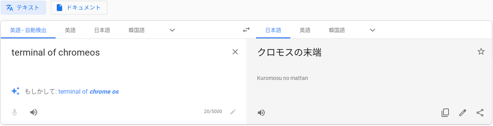
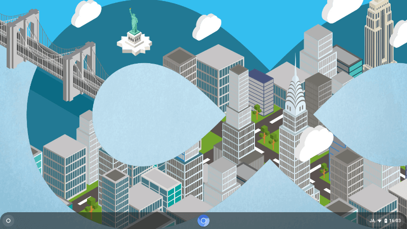
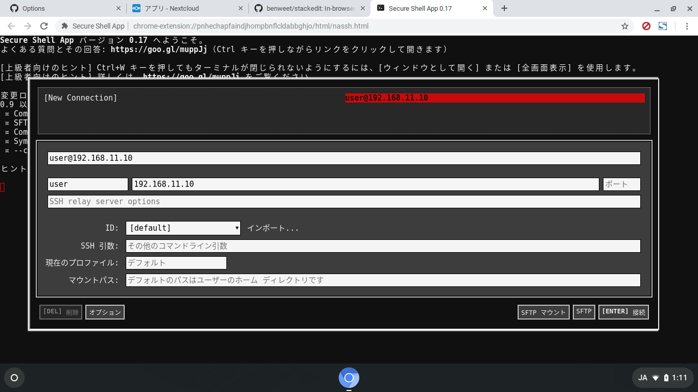

# 03 - クロモスの末端

「ふたつ訂正しておきたいことがあるんだけど」  
『何だ』  
「ひとつめ。Chromeのターミナルは私がおかしい使い方をしているだけで、英語を扱うだけなら全然崩れません。とても便利です」  
『それ本心か？』  
「本心だよ。当たり前じゃん。だってブラウザがあればssh接続できるんだもん。どんなガラクタでもsshさえ使えればなんとかなる」  
『そ、そうか…。じゃあ2つ目は？』  
「何だっけ」  
『おおっとぉ、ポンコツなのはユーザーの方かーぁ？』  
「『かーぁ？』って表現面白いね。何て発音するの？窓から投げ捨ててあげようか」  
『笑顔でキーを強く押すな…こ…壊れる…』  

## [CloudReady](http://www.neverware.com/freedownload)

「もし自分のノートパソコンにChrome OSを入れたいなら[CloudReady](http://www.neverware.com/freedownload)が一番簡単だと思う。インストールの仕方がわからないとか、もっと手軽にChrome OSを試したい人はChromebookを買うのがおすすめです」  
『使ってみた感想は？』

「良い点は、

- インストールに手間がかからない
- インストールしてすぐChromeとGoogle日本語入力と日本語のフォントが使える
- Chromebookだったらタッチパッドと無線LANとスピーカーの動作も保証されている
- 標準でCapsLockをCtrlに入れ替える機能がついている

逆にいえば、そのあたりのこまごまとした設定を苦にしないとか、トラブルが好物な人はLinuxとかWindowsでもいいかもしれない」

『うーむ、上3つは当たり前のことじゃないのか？インストールとか、日本語が使えるとか』  
「ええと、そうだな、インストールに手間がかからない、というのを別の言い方すると、Chromebookを家に忘れて出張しちゃった人が、出張先で別のChromebookを買えればなんとかなる、かもしれない」  
『ほお』  
「 **Chromebookは安いパソコンではなくて、銀行のATMみたいに、ネット上にある自分のデータにアクセスする端末のひとつ** 、というかそういう使い方をするのが理想なんだと思う」  
『買い替えてもすぐにふだんの作業環境を整えられるということだな？』   
「そう。そういう使い方をすれば」  
『なるほど。君が以前VT100の話をしたのはこういう意味だったのか』   
「そうそう。一応、Linuxのソフトをインストールする方法もあるけど、本格的に使おうとすると、Chromebookの場合はストレージが少なくて、CloudReadyの場合はCrostini自体が動かない場合があるから、各自工夫しましょうって感じ」

## [Secure Shell App](https://chrome.google.com/webstore/detail/secure-shell-app/pnhechapfaindjhompbnflcldabbghjo?hl=ja)

「ようやく訂正しておきたいことのふたつめを思い出したかもしれない」  
『おお、良かった。何だ？』  
「違うかもしれない」  
『…とりあえず聞こう』  
「私がChromeのターミナルと言ってきたのは[Crosh](https://chromium.googlesource.com/chromiumos/platform2/+/master/crosh/README.md)ではなく実はこのSecure Shell Appです」  
『その2つはどう違うんだ？』  
「CroshはChrome OSを開発者モードにしないとsshが使えない。そんな恐ろしいことを私はしないので、開発者モードにしなくてもssh接続ができるこのアプリを使った」  
『ふむ』  
「終末のChrome OSというタイトルもターミナル (terminal) の訳語から来てます」  
『本文には終末の要素は微塵もないがな』  
「ssh接続で素のviを使って小説を書く、というのは終末感がなくもない」  
『確かに…ところで、この作品のサブタイトルに意味はあるのか？』  
「友達を〜ってやつ？」  
『そう。それも『終末の』みたいに、単に人をひきつけるためのものなのか？』

「これは『誓い』だよ、私の」  
『誓い？』  
「sshでもviでも何でも、とにかく壊れるまで君を使ってみせるっていう、私の誓い。32bitのChrome OSは今年の8月でサポートが終わるし、Debianがいつまで32bitのバージョンを出してくれるのかわからないけど、それが過ぎても絶対に君を見捨てないよ」

『…私は丈夫なのがとりえだからな。君の方が先に参っちゃうかもしれないぞ』  
「いいよ、そのときは君も棺に入れるから」  
『ダメだ。いかなる場合でも故意に私を壊すのは反則だ。だろ？』  
「えー」  
『なんとしてでも私より長く元気でいてもらわなくてはな。ははは』  
「おっと手が滑った」  
『おい、やめろ！故意に壊すなと言ったばかりだろ！？』

 
 
(c) 2019 jamcha (jamcha.aa@gmail.com).

