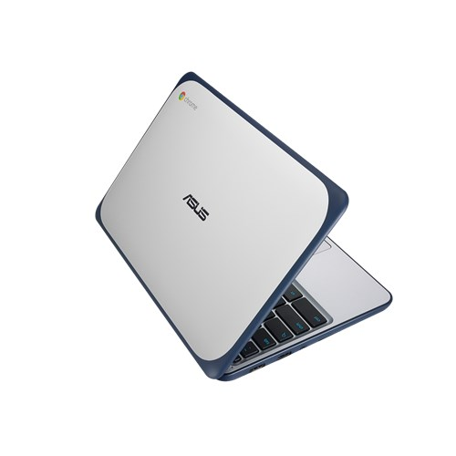
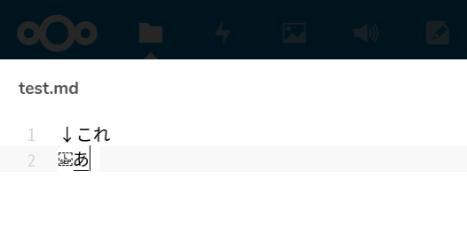
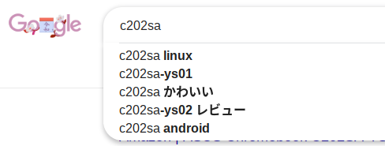
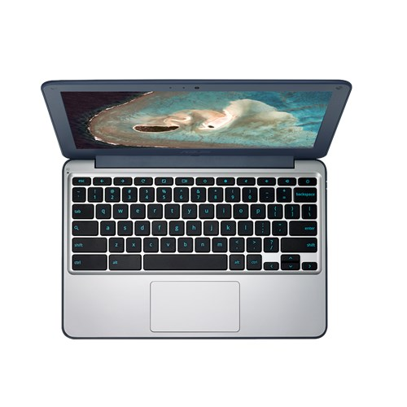

# 04 - C202SAと最後の2年間: 後継者

  
(c) [AsusTek Computer Inc.](https://www.asus.com/us/Commercial-Laptops/ASUS-Chromebook-C202SA/)

[『とらとらTravis』](https://jamcha-aa.github.io/travisci/) からしばらく経った頃。

私が新たな仲間『Chromebook C202SA』のスイッチを入れ、セットアップ画面で言語を切り替えると、まもなく元気な挨拶が聞こえてきた。  
『こんにちはマスター！ぼくを買ってくれてありがとう！これから精一杯お手伝いしますね！』

 

「…くをー」

 

か、かわいい…。

私は顔がにやけそうになるのをなんとか耐え、歯を食いしばった。  
「…早速だけどひとつ不満を言っておきたい」『はいマスター！何でしょうか？』

「新品で売っているのにあと2年しか使えないことだよ」

『あ…』C202SAの声が小さくなった。

>[Google は新しい各ハードウェア プラットフォームに対して 6.5 年間の自動更新をサポートしており、〜 6.5 年という期間は、そのプラットフォーム上で最初のデバイスがリリースされた日から計算されます。](https://support.google.com/chrome/a/answer/6220366?hl=ja)

|  **プロダクト** | **自動更新の有効期限** |
| :--- | :--- |
|  Chromebook C202SA | 2021 年 6 月 |

「Windowsとかと違ってOSを入れ替えられないんだから、こういうのはスペックのところに書いておくべきだと思うんだけど」  
『すみません、マスター』しおらしくC202SAが言う。  
「安いといってもそれなりに値が張るものだし、間違って買って後悔する人もいるかもしれない」  
『…あの…もし、ぼくにご不満なら、返品なさいますか？』  
笑顔の出会いから一転、C202SAは私が買ったのを悔やんでいると思い、落ち込んでしまったようだ。

「んー、どうしようかな…」私は顔をかたむけて困った表情をみせる。心で血の涙を流しながら。耐えろ、私。本当はすぐにでもC202SAを使ってあげたい。けれども、サポート期限がさほど長くないという事実を隠して、このコンピュータと付き合うことはできない。

 

『後輩をからかうのはそこまでにしておかないか』

 

二人の会話に落ち着いた声が割って入った。EeePCだ。  
「そうだね」私は相槌をうつと、C202SAに向き直り頭を下げた。「ごめんね！私は君に不満はないし、返品する気なんか全然ないよ！」

『え？』きょとんとするC202SAをよそに、私はChromeを起動すると、最初で最後の確認作業に入った。

「うーん、やっぱり表示されちゃうか…」『？』  

残念な顔をする私に、状況が飲み込めないC202SA。

「よし！少しおしゃべりしよう！」

そこでようやく、私はこれまでのいきさつを話し始めた。

[第2話](https://jamcha-aa.github.io/cloudready-VT/article/02.html) でとりあげた[NextcloudのMarkdown Editor](https://apps.nextcloud.com/apps/files_markdown) には、Google日本語入力の変換前に『改行文字』が誤表示される問題があった。これがCloudready特有の問題なのか、それともChromeOS全般で生じるのか、私は本家ChromeOSを搭載するChromebookで直接確かめようとした。そうしてC202SAに会った。

出会ってしまった。

『そうだったんですか…。あの、ぼくを買う前に、あと2年しか使えないのはご存知でしたか…？』「もちろん！」『それじゃあ、どうしてぼくを』

「ふふーん」私は自信げに指を立てた。「[C204MA](https://www.asus.com/us/Commercial-Laptops/ASUS-Chromebook-C204MA/) がまだ売ってなかったから、っていうのもあるけど、それよりも、君があの子と同じだと思ったからかな」  
そう言って私は立てた指を倒し、EeePCを指した。あの子、と呼ばれたEeePCは文句を言いたげだった。

EeePCもいつかは壊れる。そのとき私は確実に『[EeePCロス](https://ja.wikipedia.org/wiki/%E3%83%9A%E3%83%83%E3%83%88%E3%83%AD%E3%82%B9%E7%97%87%E5%80%99%E7%BE%A4)』になる。EeePCロスを和らげるには、EeePCが壊れる前に新しい仲間を得ることなのだが、それにはいくつかの条件をクリアしなければならない。

- **かわいい**
- 控えめのスペック
- 控えめのサイズ
- 控えめの価格
- 地球を何周しても壊れない頑丈さ
- ASUS製
- **かわいい**

  
(c) [AsusTek Computer Inc.](https://www.asus.com/us/Commercial-Laptops/ASUS-Chromebook-C202SA/)

ASUS製であることをのぞけば、古くは [eMate 300](https://ja.wikipedia.org/wiki/EMate_300) もあてはまる。教育向けのコンピュータはこの条件を満たしやすいのかもしれない。

『私はあと2年じゃ壊れないぞ』EeePCがたまらずに言った。

「ファンが壊れているのに何を偉そうに」『それくらいじゃ壊れないと言ったのは君だろう。先にこの後輩の方が使えなくなってしまうんじゃないか？』

「たしかに。それはあるかも」私はC202SAに向き直って言った。「私はどうすればあと2年で君を壊せるか本気で考えているし」

『ひぃっ』C202SAが情けない声をあげた。

「でもASUSだしなあ。壊れないだろうなあー。CPUに負荷かけても、温度が高すぎると周波数落としちゃうんだよねぇ」私は困った表情をして腕を組む。

壊れないことに困る、という異常な会話に、C202SAは自分自身にかけられた多大な期待と、これからの約束された酷使の日々に不安を抱いている。それでも自分の役目を思い出し、はっきりした調子で言った。

『あの、ぼく、どれだけ雑に扱われても平気です。だからサポートが切れるまで頑張ります！』

 

「あーっ！」

 

あまりの健気さに私は倒れ込み、床でもだえた。

私は！

私は！！

こんな心優しいアシスタントをずっと待っていたんだ！！！

「使う！使います！使わせてください！サポートが切れてもファームウェアを書き換えて壊れるまで使います！」

突然暴れだし、叫びながら地面を這いつくばる私。C202SAはそんな奇怪なオーナーに買われてしまったことを後悔しはじめていた。

 
 
(c) 2019 jamcha (jamcha.aa@gmail.com).

