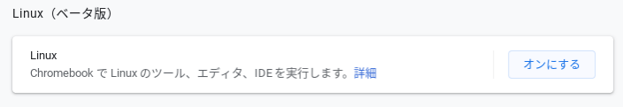
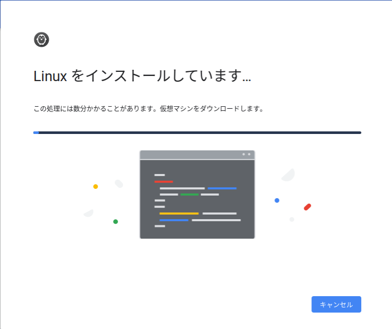
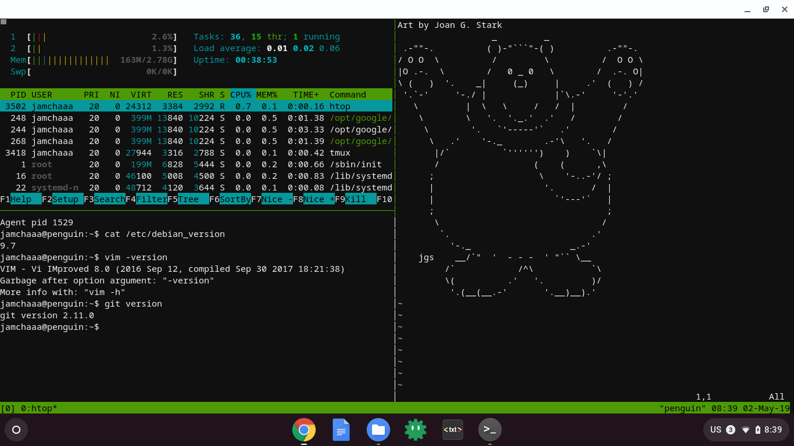
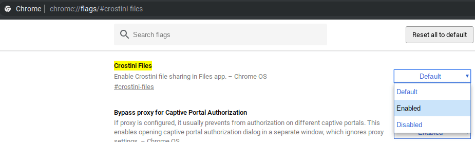
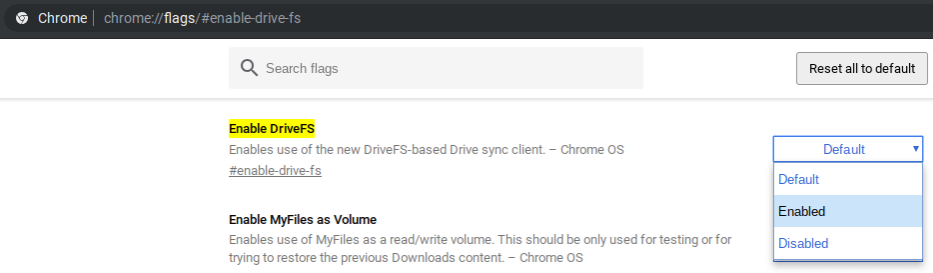
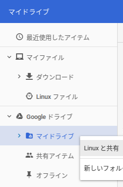

# 05 - C202SAと最後の2年間: Crostiniの葛藤

「すごいね、君、セットアップが終わっても300MBくらいしか使ってないよ」  
私はChromeOSの小ささに驚いた。これなら保存容量が16GBでもなんとかなりそうだ。  
『はいマスター！ありがとうございます！』

「あー…」私は頬をかく。「その『マスター』って言い方、やめない？私そんな偉くないよ」  
『はぁ、では何とお呼びすればいいでしょう』  
「そうだな…」

私はEeePCを見て言った。「ねえ、君は私のこと、何て呼んでる？」
『え？君のことか？』ふいに呼ばれたEeePCは変な声を出した。  
思わず私は吹き出し、こんどはThinkPadの方を見る。ThinkPadは 『[Emacsのチュートリアルをプレイ。](https://jamcha-aa.github.io/Emacs-tutorial/)』 で加わった、優秀なアシスタントだ。  
「ねえ、君は私のこと、何て呼んでる？」『ゴミ』「スクラップにしてやろうか」『あなた、です』

はあ。あきれた顔を元に戻し、私はC202SAに向き直って言った。「こんなふうにさ、私は君の主人でも何でもないから、もっと気楽に呼んでよ」

『え、ええと』予想していた主従関係と違い、慌てるC202SA。『…じゃあ、『あなた』とお呼びしてもいいですか？』「もちろん！」

私が笑顔で答えると、C202SAはほっとしたように見えた。

## Files.app の落とし穴

「ぐ…」

先の笑顔からほどなく、私はGitHubのWebページを開いたまま、苦悶に満ちた表情でC202SAのタッチパッドに触れていた。

「くぅ…」

ChromebookのファイラーからChromeにフォルダのドラッグアンドドロップができない。これではGitHub Pagesで作品の更新ができないではないか。[GNOMEのファイラ](https://wiki.gnome.org/action/show/Apps/Files) やMacのFinderからはできていたはずなのだが。

『[とらとらTravis](https://jamcha-aa.github.io/travisci/)』での試行錯誤を経て、私は『あの黒い画面』に頼らないGitHubの使い方を身につけたと思っていた。けれども、仮にセキュリティ上の理由だとしても、ファイラーからフォルダのアップロードができないのであれば、フォルダ操作のためには『あの黒い画面』に頼らざるを得ない。

どうしても私は『あの黒い画面』から逃れられないのか。

『ちょっといいですか？』苦しむ私にいてもたってもいられずC202SAが助け舟を出した。『Crostiniという機能をご存知ですか？ChromebookでもLinuxのソフトウェアが使えますよ』

「そ…！」怒鳴ろうとして私はこらえた。「知ってる…けど、使いたくない」

Linuxのソフトウェアを使いたいならLinuxのパソコンでいいし、Androidのアプリを使いたいならAndroidのタブレットでいい。

私が使っているのは…Chromebookなんだ！！

「うわああああああああああああ！」

「うわああああああああああああ！」

「あああ…」

「堕落だ…」

私は肩を落とし、うなだれた。理性とは裏腹に本能が『あの黒い画面』を導入してしまう。

「…」

「…ねえ」『はい！』

闇に染まりきってしまった私の心は止まらない。

「CrostiniとGoogle Driveの連携ってできるのかな」『もちろんですよ！』

「ひひ…」

「ひひひ…」

「おお…」

「こォー…」私は自らの業の深さに頭を抱えた。GitHubのリポジトリをGoogle Driveで扱うなんて、なんて罪深い行為なんだ。しかも無垢な新人アシスタントの容量を1GB以上も使い、こんな非道な行いの手伝いまでさせてしまった。

C202SAの心配そうな声が聞こえる。『あの、大丈夫ですか？具合が悪そうですが、休憩しますか？』「平気だよ…ありがとう…」『無理しないでくださいね！』

親切な気遣いに私は微笑んだが、内心、敗北した気持ちでいっぱいだった。

くそっ。

こうなれば、『あの黒い画面』と地獄の果てまで付き合ってやるぞ。

 
 
(c) 2019 jamcha (jamcha.aa@gmail.com).

