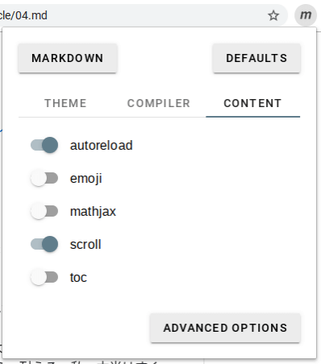
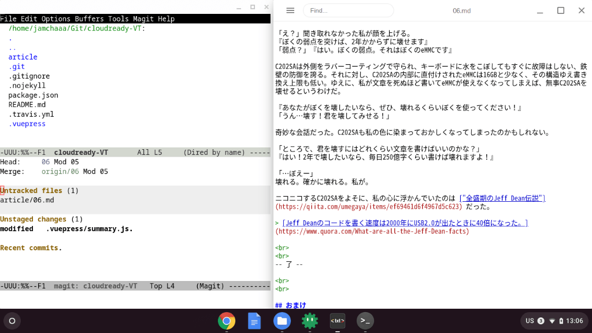

# 06 - C202SAと最後の2年間: 思い出を作ろう

『あのー』「なに？」  
『どうして手に山芋を持っているんですか？』「君の天板に凹凸があるから、おろし金に使えるんじゃないかと思って」

『ひいー、ご乱心！や、やめてください！』「大根だと硬いから無理そうだね」『そういう問題じゃありません！』

＊＊＊＊

『そうまでしてぼくを壊したいんですか？』
少し苛ついた調子でC202SAが言う。  
「すみません…どうしても君を壊したいんです…」  
『ちょっと』C202SAがあきれる。『どうしてもって、そんなにあなたはぼくが嫌いなんですか？』  
「逆だよ」『逆？』

「君が公式にサポートされている間に、使って使って使いまくって、壊れるくらい使って、数えきれないくらいたくさんの思い出を作りたい」

『…あなたは』  
「でも私の使い方じゃ君を2年で壊せない。君にはこれだけの力があるのに、その全力を引き出せない私が情けない」  
『…』  

あなたは、…ですね。

「え？」聞き取れなかった私が顔を上げる。  
『ぼくの弱点を突けば、2年かからずに壊せます』  
「弱点？」『はい。ぼくの弱点。それはぼくのeMMCです』

C202SAは外側をラバーコーティングで守られ、キーボードに水をこぼしてもすぐに故障はしない、鉄壁の防御を誇る。それに対し、C202SAの内部に直付けされたeMMCは16GBと少なく、その構造ゆえ書き換え上限も低い。ゆえに、私が文章を死ぬほど書いてeMMCが使えなくなってしまえば、無事C202SAを壊せるというわけだ。

『あなたがぼくを壊したいなら、ぜひ、壊れるくらいぼくを使ってください！』  
「うん…壊す！君を壊してみせる！」

奇妙な会話だった。C202SAも私の色に染まっておかしくなってしまったのかもしれない。

「ところで、君を壊すにはどれくらい文章を書けばいいのかな？」  
『はい！2年で壊したいなら、毎日250億字くらい書けば壊れますよ！』  

「…ぼえー」  
壊れる。確かに壊れる。私が。

ニコニコするC202SAをよそに、私の心に浮かんでいたのは ["全盛期のJeff Dean伝説"](https://qiita.com/umegaya/items/ef69461d6f4967d5c623) だった。

> [Jeff Deanのコードを書く速度は2000年にUSB2.0が出たときに40倍になった。](https://www.quora.com/What-are-all-the-Jeff-Dean-facts)

 
 
-- 了 --

 
 

## おまけ
「そんなわけで新しい仲間にまで本当のバカと言われた私がChromebookで調べた知識をおまけで付けておきます」  
『聞こえてたんですね…』  
「私は君に侮辱されたことを絶対に忘れない」  
『申し訳ありません…』  
「一緒に水に沈もう」  
『ああー！だめです！絶対にだめです！』

### Aura: ChromeOS window manager

「ChromeOSが [gentoo linux](https://www.gentoo.org/) をベースにしていたのは知ってたんだけど、ディスプレイサーバはX11じゃなくて自前のものを使っているらしい」  
『へえ…』  
「[Chrome Compositor](https://dev.chromium.org/developers/design-documents/aura/graphics-architecture) っていうらしいよ」  
『はあ…そうなんですか…』  
「興味ないの？」  
『あまり…』  
「『絵が画面に出る』って不思議じゃない？NextStepがDisplay Postscriptとか、macOSがQuartz Compositorとか興味ないの？」  
『うーん…不思議かもしれませんけど…そんなもんなんだなって。すみません…』  
「面白いっていうまで言い続けるよ？」  
『すごい！全然知りませんでした！すごく面白いです！』  
「でしょ！それでChromeOSのウィンドウマネージャは[Aura](https://dev.chromium.org/developers/design-documents/aura) っていってね、これも自前なんだけど、あ、ウィンドウマネージャのことはわかる？jwmとかi3とか、Enlightenmentとか！」  
『あ…あはは…』

### Google日本語入力の二重かぎ括弧

「Google日本語入力とか、[SKK](https://github.com/skk-dev/ddskk) で有名な技のひとつ。二重かぎ括弧 (『　』) は `z` + `「` で出せます。いちいち変換しなくていいので便利」  
『はい！』  
「`z` は `h` `j` `k` `l` と組み合わせて矢印 (←↓↑→) を出せたりもします」

### deleteキー: `alt` + `backspace`

「Chromebookはdeleteキーがなくて、かわりに `alt` + `backspace` を使う」  
『ファンクションキーもありませんね』  
「ただし日本語を入力しているときはいくつかのキーを有効にできる」

[Chromebook のキーボードを使用する](https://support.google.com/chromebook/answer/1047364?hl=ja)

「たとえばカタカナ変換は `画面の明るさを上げる` キーが `F7` の代わりになります。でも `F2` でファイル名を変換するとかはできないので、 `ctrl` + `enter` を使いましょう」

### [Markdown viewer](https://chrome.google.com/webstore/detail/markdown-viewer/ckkdlimhmcjmikdlpkmbgfkaikojcbjk?hl=ja) の自動リロード

「Chromeの拡張機能 [Markdown viewer](https://chrome.google.com/webstore/detail/markdown-viewer/ckkdlimhmcjmikdlpkmbgfkaikojcbjk?hl=ja) はファイルの更新をすると自動で読み直してくれる便利な機能があるんだけど、初期設定だと無効にされているので、設定メニューで有効にするといいかもしれません」

### ラバーコーティングがベタベタしてきたら

「衝撃吸収のために外側がラバーでコーティングされていて、それがかわいい」  
『ありがとうございます』  
「でも時間がたつと加水分解でべたつく」  
『すみません…』  
「べたついたら激落ちくんとかのメラミンスポンジで拭けばきれいになります」  
『本当ですか？』  
「同じ素材のケースで昔試したので本当です。ほとんどの人はサポートが切れたら廃棄しちゃうと思うけど、もしファームウェアを書き換えたりして長く付き合いたい人は知っておくと得です」

### Crostiniの設定画面: `ctrl` + `shift` + `P`

「結局Gitを使うために『あの黒い画面』を導入してしまいました。私は敗北者です」  
『自分を責めないでください…』  
「ChromeOSのLinuxターミナルは `ctrl` + `shift` + `P` で設定できます。色とかベルの音を無効にするとか」  
『『あの黒い画面』が黒くないのは色を変えてるからですね』  
「うん。…ねえ、何か聞くことあるんじゃない？」  
『え？えっと、質問…ですか？』  
「『エディタは何使ってるんですか』でしょ！」  
『ええっ？エディタ！？』  
「そうだよ！せっかく文章書いてるんだから、使ってる道具くらい聞くのが普通でしょ！」  
『はあ、そうなんですか…。すみません…』  
「まったく…」  
『…』  
「…」  
『…？』  
「聞いてって言ってるの！」  
『あ、ああ！はい！エ、エディタは何使ってるんですか！？』  
「ふふーん、インストールしたときに入ってた [Text](https://chrome.google.com/webstore/detail/text/mmfbcljfglbokpmkimbfghdkjmjhdgbg?hl=ja) です！」  
『へー…』  
「…君、コンピュータなのに本当にそういうのに興味がないんだね」  
『すみません。公式のヘルプ以外には、あまり…』  
「OSをあまりいじらずに使うことのかっこよさを話したかったのに」  
『ごめんなさい…』  
「私が本当に悔しい思いでCrostiniを入れたこととかも」  
『…』

 

「…そうだ！いいこと思いついた！YouTubeみよう！」  
『え？YouTubeですか？』  
「みたいものがあったんだよ！一緒にみよう！」  
『はい！ (やった！)』

[“懐かし” のグラフィックの仕組み その 2—Apple と Atari](https://www.youtube.com/watch?v=_rsycfDliZU)

『…』  
「つまり青とオレンジは補色の関係にあるから人間には白にみえるわけ。すごいでしょ？視覚の仕組みを利用したテクニックなんだよ！天才でしょウォズって！」  
『…。ううっ…』  
「ね、すごいでしょ？すごすぎて感動した？」  
『…そうですね、本当に…このひと頭おかしい…』  
「よし！次はQuickDrawを作ったビル・アトキンソンのインタビューをみよう！」  
『もうやめて…』

 
 
(c) 2019 jamcha (jamcha.aa@gmail.com).

