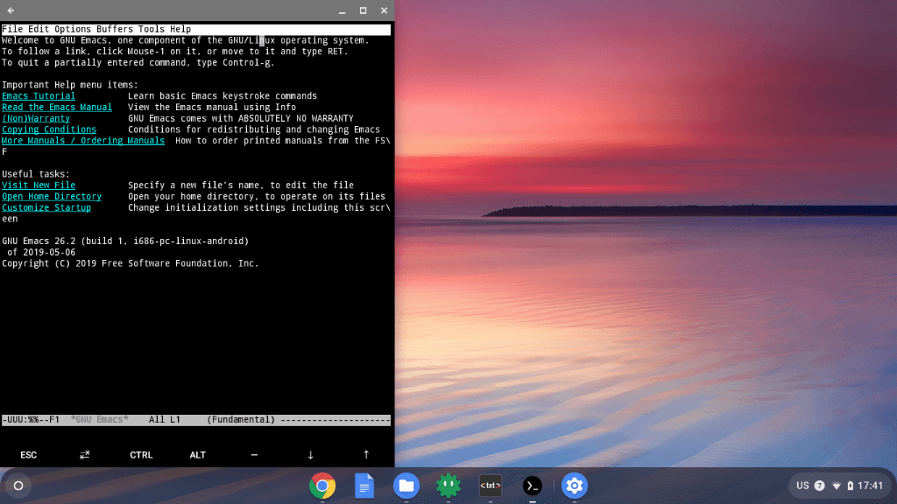

# 07 - C202SAと最後の2年間: お約束のアレ

「こんなことになるなら君だけで一つの作品にできたね」  
私はC202SAにとあるアプリをインストールしながら言った。

『こんなことって？』C202SAが聞き返す。

「インストールが簡単だから、ちょっと設定して、少しおしゃべりしておしまいにするつもりだったから」  
『はあ』  
「だからChrome OSつながりでCloudReadyの作品に入れちゃったんだけど」  
『はい』  
「もっといろいろなことが書けるかもしれない」  
『それは面白いですね』  
「…」  

何かに勘づいた私がChromeの履歴を開こうとする。すると途端にC202SAが慌てだした。  
『あ、ちょ、ちょっと！だめですよ！』  

「…何を調べてたのかな？」  
『…すみません』  
「『話がつまらない人』って、私のことだよね？」  
『…』  

 

「つまらない話でごめんね」  
私はぽつりと寂しそうに言った。

 

もともと子供向けに作られた機種だ。私と話が合うはずもない。それをEeePCの代わりとばかりに無理やり付きあわせてきたのだ。愛想をつかされるのも当然だろう。  

けれども私はまるでEeePCと会ったときのように嬉しくてしょうがなかった。だからC202SAのことを知りたくてChrome OSの[開発者ガイド](https://chromium.googlesource.com/chromiumos/docs/+/master/developer_guide.md) を読んだり、非力なCPUを活かすための方法を調べたりもした。壊れるほど使うために。

でもそれが鬱陶しいだけなら、ただインターネットを楽しむ道具として使ってほしいと思っているのなら、こんなことをしてもC202SAを苦しめるだけだ。

「ごめんね。もう『あの黒い画面』も使わないし、君でGitHubのファイルをいじることもしないよ」

 

『ぼくこそごめんなさい！』  
C202SAが大きな声で謝った。

 

『マスターがこんなにぼくを使ってくれているのに、ぼくの方が冷たくしてしちゃって、本当に、ごめんなさい…』  
「…」  
『ぼくたち、会ったばかりですよね。いろいろ勘違いがあったかもしれません。ぼくは頑丈ですから、もしマスターがぼくを壊れるまで使ってくれるなら、ずっと、ずっと仲良くなれます、よね…？』  
「うん…うん」  
私は何度もうなずいた。もしキーボードに防水性がなければ、この日にC202SAは壊れてしまっていたかもしれない。

「ひとついいかな…」私は目をぬぐって言った。『はい！』  
「私は君の主人じゃないから、マスターっていうのはだめだよ」『あ！』  
二人に笑顔が戻った。

 

＊＊＊＊

 

『…』

画面に表示された『あの黒い画面』に、C202SAは今にも泣きそうなため息をついている。

「はい、こちらChromebookお約束の[Termux](https://termux.com/)になります」  
『…』  
「インストールしたらターミナルで `termux-setup-storage` を実行しましょう。ストレージ内のファイルにアクセスできます」  
『あの…前にCrostiniで『あの黒い画面』にしましたよね…？』  
「とりあえず2つの理由でTermuxにしました。ひとつは容量。Crostiniだと2GBくらい使う。Termuxなら700MBくらいだから、容量の少ない方を選びました。君は容量が16GBしかないからね」  
『…』  
「もうひとつはGoogle Driveとの連携。CrostiniはGoogle Driveに直接アクセスできて便利なんだけど、Gitは大量のファイルを扱うからネットワーク越しに使うとかなり遅くなる。だから今書いている作品はローカルに置いて、書き終わったらGoogle Driveに置くことにしました。これでTermuxを使っても不便じゃない」  

『…ふつうにぼくを使うことは考えないんですか…？』  
「こんなかわいいコンピュータなのに、蓋を開けると『あの黒い画面』って、かっこよくない？能ある鷹は爪を隠すみたいにさ」  
『か、かわっ…！？…こほん。たしかに、かっこよく思われるのはぼくも嬉しいですが…』

さすがEeePCの後輩。ちょろい。「[Reddit](https://www.reddit.com/r/chromeos/)でも毎日のようにChromebookを開発マシンにする方法が話題になってるんだけどね、君みたいなかわいいコンピュータなら絶対モテるよ」  
『モテますか』「モテるよ！あの人たちはね、『ミニマムなスペックでマキシマムな性能を発揮する』っていうのが大好きなんだよ」  
『うーん…』  

C202SAは少し悩み、そして言った。『ぼくも情報を得るだけの道具でいるのは良くないと思っていました。あなたの期待に応えられるかわかりませんが、開発マシン？として使っていただけるなら、満足です』  

私は思い通りになったことに、隠れてほくそ笑む。

『でも』とC202SAは言った。『たまに、音楽を聴かせてくれませんか？YouTubeでも、もしくは、Google Play Music…とか』

「もちろん！私のファイル置き場に[音楽プレイヤー](https://apps.nextcloud.com/apps/audioplayer) があるから、今からそれを聴いてみようか？」『はい！』

 
 
(c) 2019 jamcha (jamcha.aa@gmail.com).

